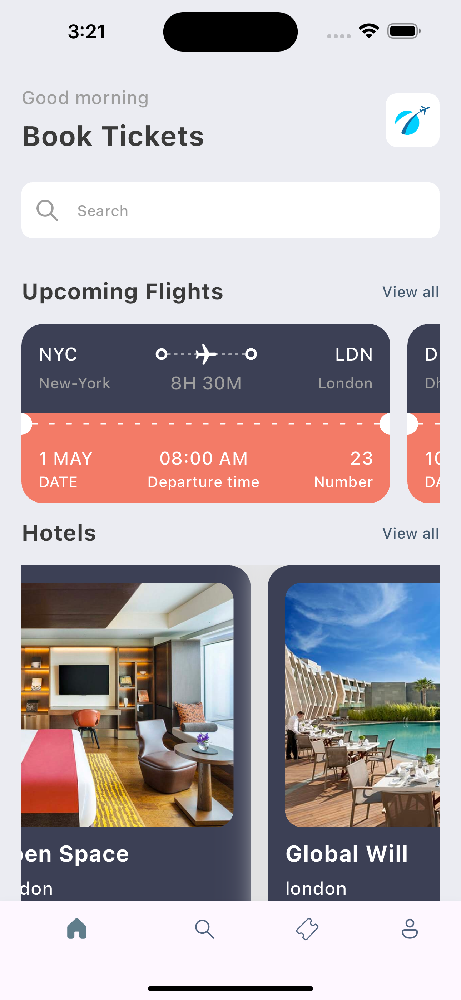
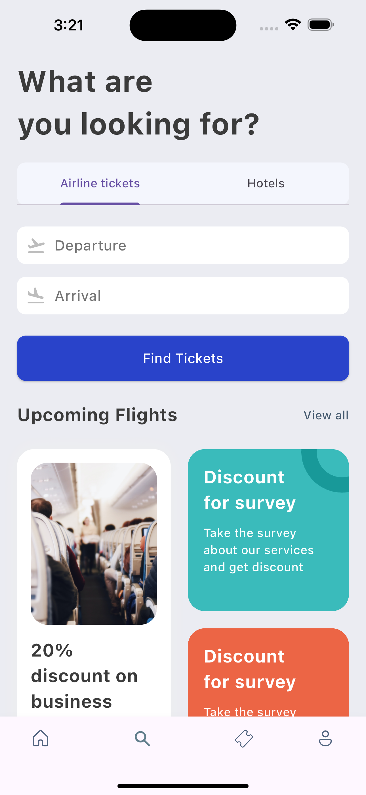
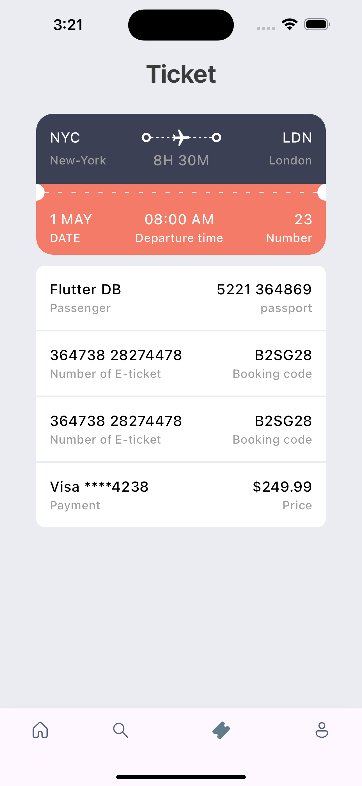

# 小專案 - Book Ticket Practice

練習複雜版面構建的小專案，展示如何利用 Flutter 的自定義 Widget 和動畫功能。

## 專案功能

- **動畫展示**：使用 Flutter 動畫實現流暢的交互效果。
- **票務畫面設計**：練習實現模擬票務預訂相關的畫面佈局。

## 專案展示

### 畫面展示：

<table>
  <tr>
    <td></td>
    <td></td>
  </tr>
   <tr>
    <td></td>
  </tr>
</table>

### 動畫效果：

