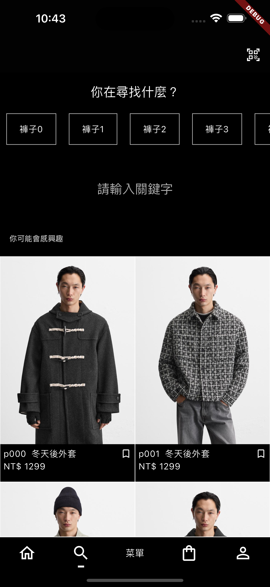
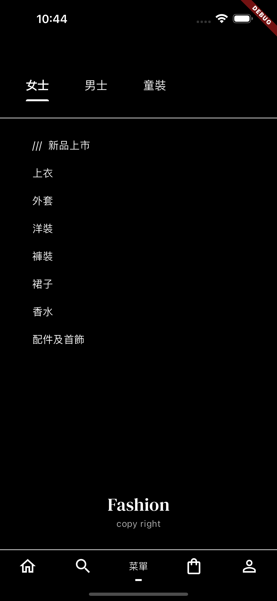
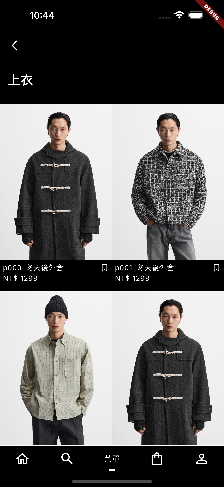
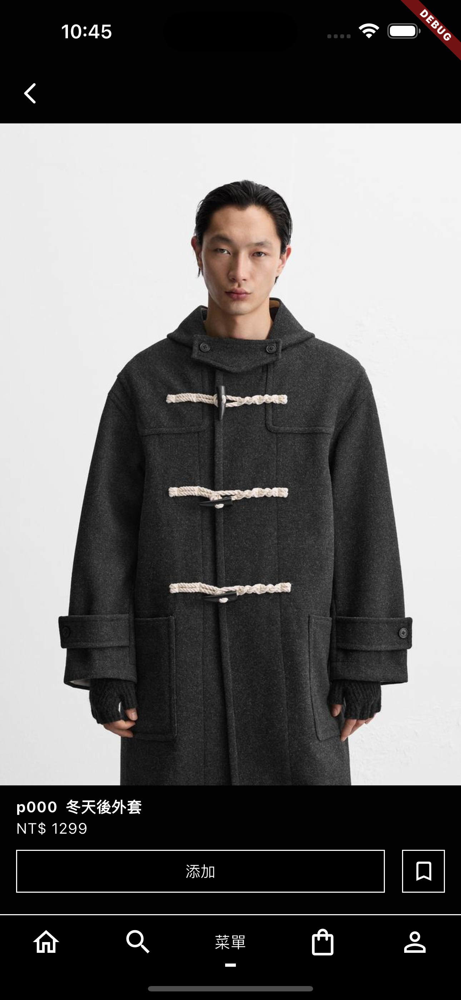
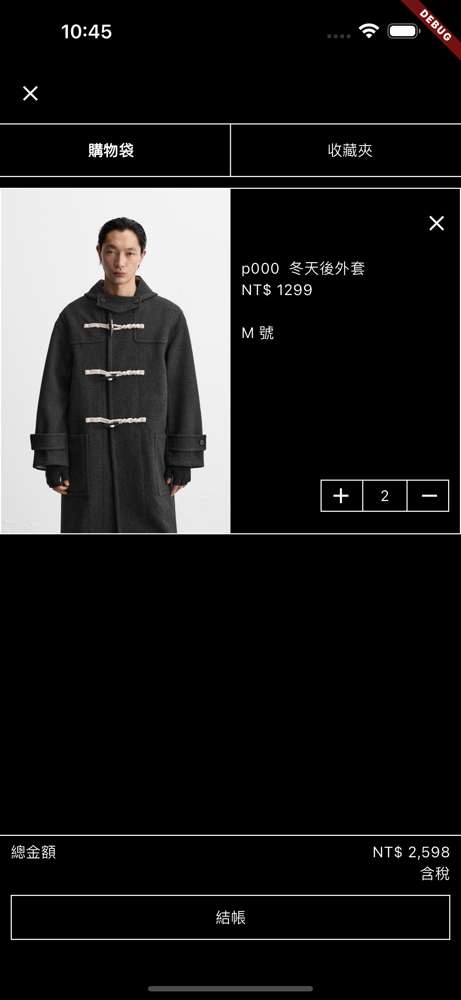

# 小專案 - Fashion Shop Challenge

這是一款模擬賣時尚服裝的 App，展示了高互動性操作、自定義 Widget 和動畫的應用。專案結合了複雜的路由導航、模擬 API 數據以及主流功能實現。

## 專案功能

- **主頁**：使用垂直 PageView 展示新品，讓用戶快速瀏覽時尚商品。
- **搜尋頁面**：提供即時搜索功能，方便查找特定商品。
- **商品頁面**：支援滑動到底部自動加載更多商品的功能（Load More）。
- **購物車頁面**：直觀的購物清單，便於管理選購商品。
- **設定頁面**：包含深色模式與淺色模式的切換，並可依手機設定自動切換。

## 技術亮點
1. **採用ＧetX狀態管理**：結合 GetX 進行狀態管理。
2. **路由導航**：採用了複雜的嵌套路由，結合 GetX 進行導航。
3. **自定義動畫及widget**
    - **自定義動畫**：從主頁切換到其他頁面或在 BottomBar 中切換時，實現流暢動畫過渡。
    - **自定義 BottomBar**：自製 BottomNavigationBar，並結合自定義 Indicator 動畫，提升使用者體驗。
4. **模擬 API 數據**：假設後端數據，模擬實際應用的數據請求與展示。
5. **專案架構清晰**：代碼層次結構明確，便於維護和擴展。

## 專案展示

### 頁面展示：

<table>
  <tr>
    <td></td>
    <td></td>
  </tr>
  <tr>
    <td></td>
    <td></td>
  </tr>
   <tr>
    <td></td>
    <td></td>
  </tr>
  <tr>
    <td></td>
  </tr>
</table>

## 操作展示
<table>
  <tr>
    <td></td>
    <td></td>
  </tr>
  <tr>
    <td></td>
  </tr>
</table>

