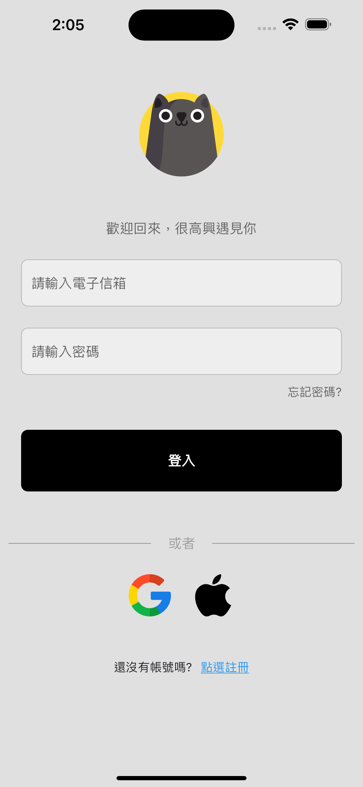
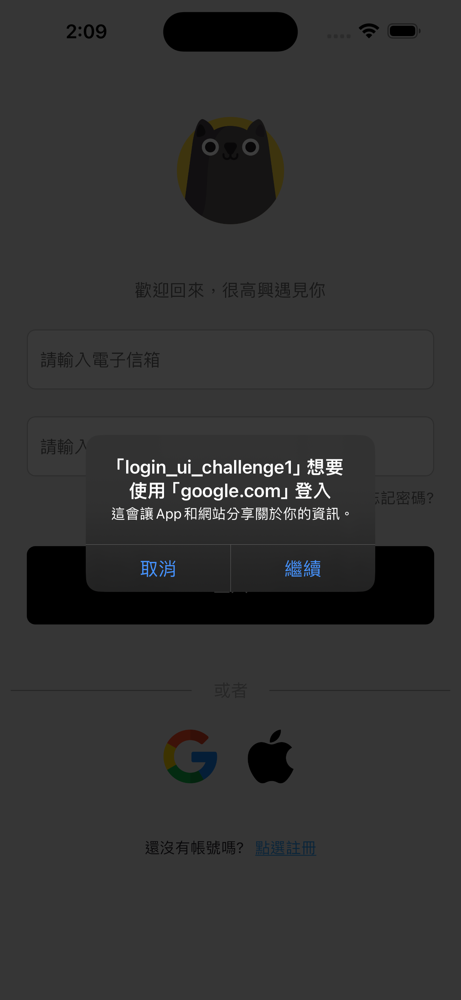
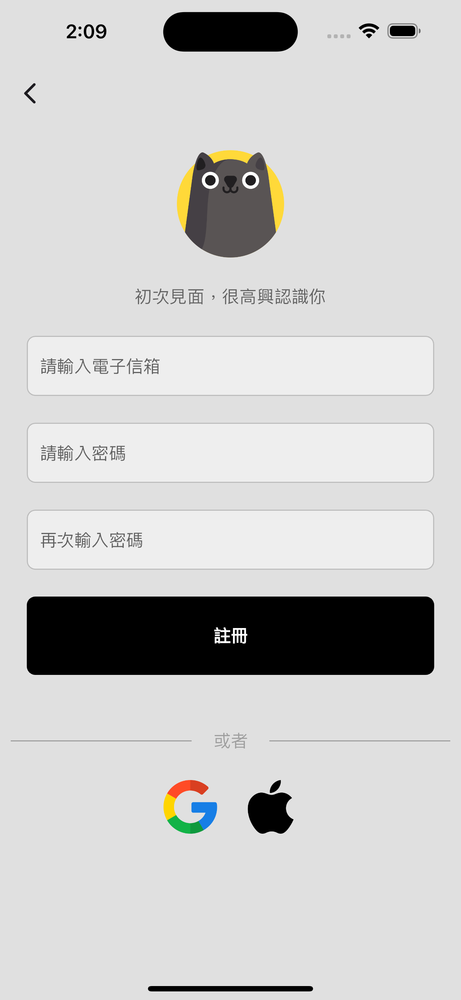

# 小專案 - LoginUIchallenge

這是一個專注於使用 Flutter 開發的登入頁面範例，主要展示了實現用戶認證功能的設計與技術。該專案整合了 Firebase Authentication，並提供了第三方登入方式。

## 專案功能

- **Email 登入**：用戶可以通過 Email 和密碼進行安全登入。
- **Email 註冊**：支持新用戶註冊功能。
- **Google 第三方登入**：簡化用戶操作，支持 Google 一鍵登入。
- **Firebase Authentication**：串接 Firebase Auth，實現後端用戶管理。

## 專案展示

### 登入頁面：
用戶可選擇 Email 或 Google 第三方登入方式。

<table>
  <tr>
    <td></td>
    <td></td>
  </tr>
</table>

### 註冊頁面：
用戶可以輸入 Email 和密碼完成註冊。

 

## 操作展示

 

