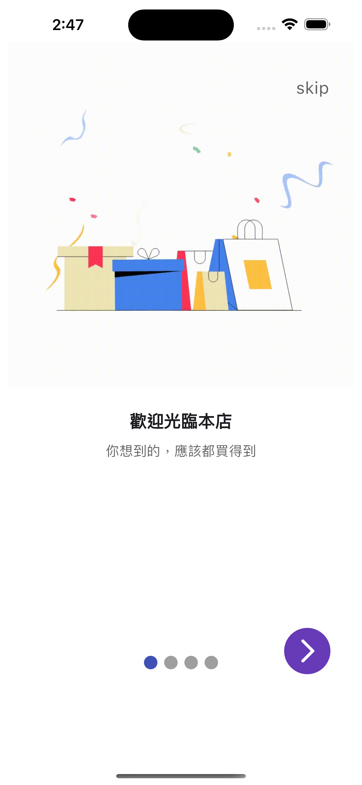
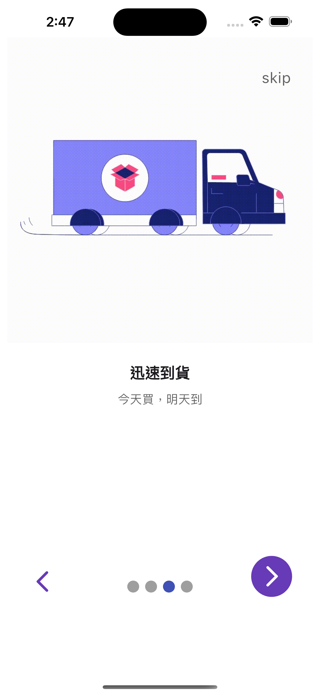
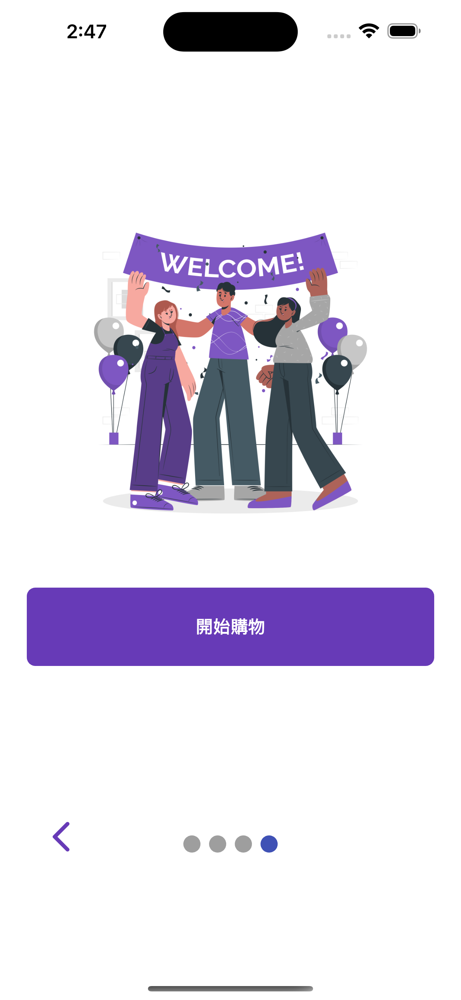

# 小專案 - OnboardingChallenge

模擬 App 中常見的前導頁功能的小專案，展示了如何創建動畫效果及使用本地資源圖片。

## 專案功能

- **前導頁設計**：模擬 App 首次啟動時的介紹流程。
- **自製動畫效果**：利用 Flutter 自定義動畫，實現文字和圖片的動態進場效果。
- **引入本地圖片**：展示如何有效管理和使用本地圖片資源。

## 專案展示

### 前導頁：

<table>
  <tr>
    <td></td>
    <td></td>
  </tr>
   <tr>
    <td></td>
    <td></td>
  </tr>
</table>

## 操作展示

