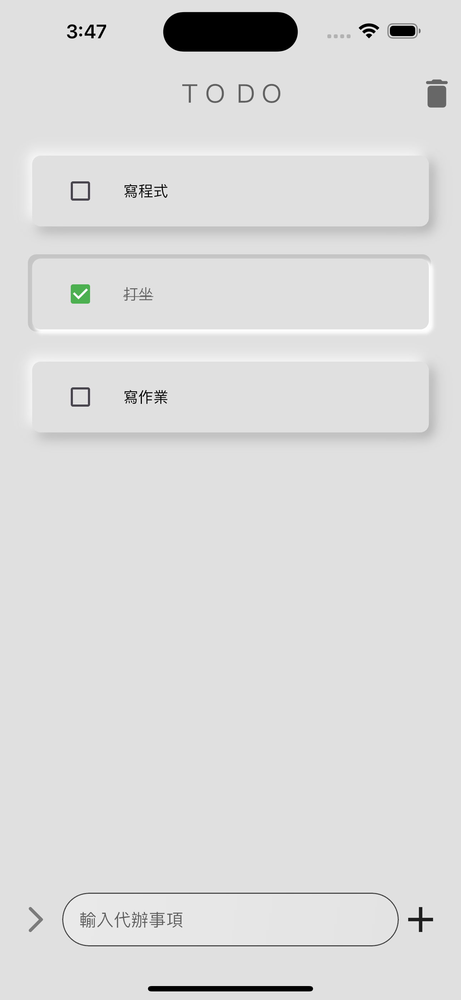
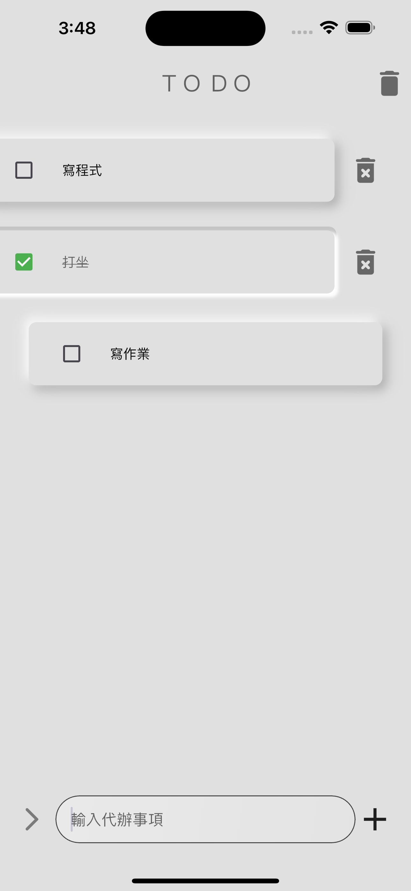
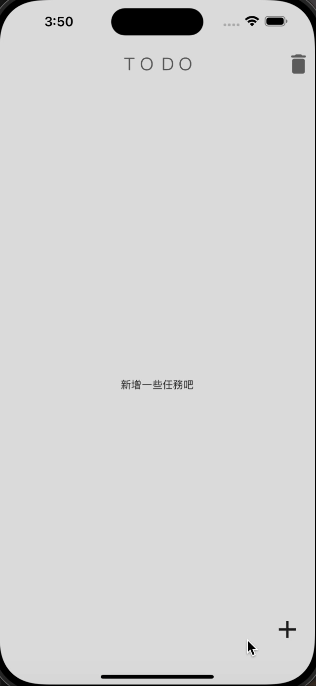

# 小專案 - To Do Challenge

代辦事項 App，展示如何使用 Flutter 實現功能完善的 UI 和互動設計。本專案著重於自定義 Widget 的應用，並結合豐富的動畫效果，提供滑動隱藏按鈕的功能，提升用戶操作體驗。

## 專案功能

- **自定義 Widget**：創建多個高度模組化的 UI 元件，便於維護與重用。
- **滑動隱藏按鈕**：使用滑動手勢觸發的自定義按鈕，實現清單項目管理。
- **豐富的動畫效果**：動畫在代辦事項的新增、完成、刪除等操作中，提升流暢度與視覺效果。

## 專案展示

### 主畫面：
展示代辦清單的整體佈局和基本操作。

<table>
  <tr>
    <td></td>
    <td></td>
  </tr>
</table>

### 滑動功能：
演示滑動手勢觸發隱藏按鈕的操作。

